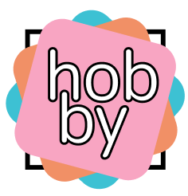
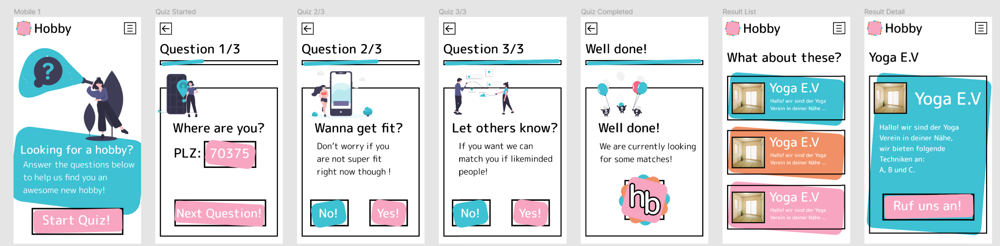

Happy last day of February everyone!

The last two days I partook in one of my favourite activities - Hackathons!

A [hackathon](https://en.wikipedia.org/wiki/Hackathon) being a fun event where you get a limited time to develop
something - in this case something related to social and/or art as the event name indicates:
 [#ArtSocial21](https://artsocial21.org/)

#### DISTRIBUTIVE JUSTICE

So the topic of the team I was assigned to was **distributive justice**.
My awesome team consisting of higher ups from several social institutions in my area and I got some very interesting
insights into the daily business of social workers.

After some brainstorming we came up with the following app ideas to pursue:
1. **DESK SURFING** allow less people to use your home office for a job interview or proctored exam
2. **LIFE SUPPORT** a chat bot directs you to a fitting support institution in your area.
3. **HOBBY** everyone should get the chance to try out several hobbies to find theirs.

#### We chose the Hobby App

I don't really know why anymore ¯\\ _(ツ)_/¯ , just from gathering feedback from friends I guess :D

The app is supposed to be as easy to use as possible and invite people to use it through it's happy and playful vibe.

We also talked about how social workers could use it for the people they help.

#### Coming up with the design

Recently I have started to dabble a bit with design. Which can be fun!

So I designed the logo and some mock ups on [Figma](https://www.figma.com/) - a design tool that I have
recently fallen in love with - not only because it is written in [Rust](https://www.figma.com/blog/rust-in-production-at-figma/)!

##### The Logo

So I wanted to include multiple *fun colors* that are supposed to portray different activities that you try out on
your journey of finding the perfect hobby for you.

The pointy rectangle in the back is supposed to be a stand-in for like a life without hobbies.

The name itself is just a WIP, I experimented with some other names like **funby** but meh, time was of the essence.

##### Mockups of the main workflow

A simple quiz is supposed to guide you to an activity-centered club around your location.

It was a lot of fun to adapt the thoughts behind the logo into the design of the single components.

#### Development

I used React in order to develop the app, in conjunction with the [Material Design Library](https://material-ui.com/)
mostly because I am familiar with it and was looking forward to using the Grid Layout stuff.

Maybe I should look into a lightweight layout library for React 🤔.

Also I definitely need to look into how I can get funky CSS transforms working on mobile and bigger displays.

Because of the time constraint (I maybe got to work on the React project for like 2-3 hours max) I just constrained
the size on bigger displays to make it look like a mobile device, sorraaayy :D

##### Deployment

For deploying I just used netlify which was easy as heck.
Especially because the app currently does not use any backend as it's just a prototype and the data is faked :')

[Check the final app out here](https://eloquent-yalow-693b2c.netlify.app)!

Oh it's german. Well. Luckily nobody reads this blog anyways :D

#### Conclusion

Participating in Hackathons is an awesome and super inspiring experience I recommend to anyone!
That being said, this one was a bit of a weird one for me, as there was a huge focus on the final pitch and there
were only a handful of developers present at the event :/

Still, I learned a lot about social injustice and the amazing people in our society that put so much effort into
helping others.

Also I appreciate the privilege of having found several hobbies in my life that give my life meaning and connect
me to other people with similar passions all around the world.

I still feel so motivated and inspired by my team and other people I met there!

I ❤ that and I am looking forward to my next Hackathon :).

